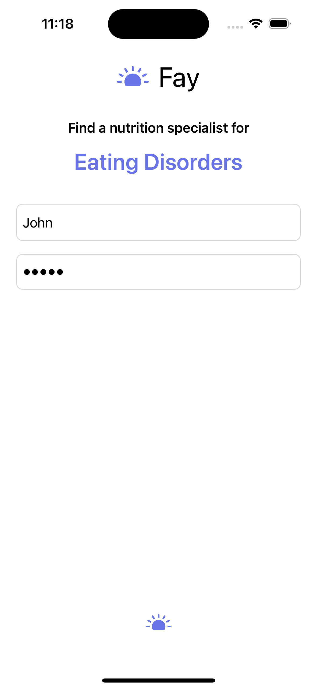
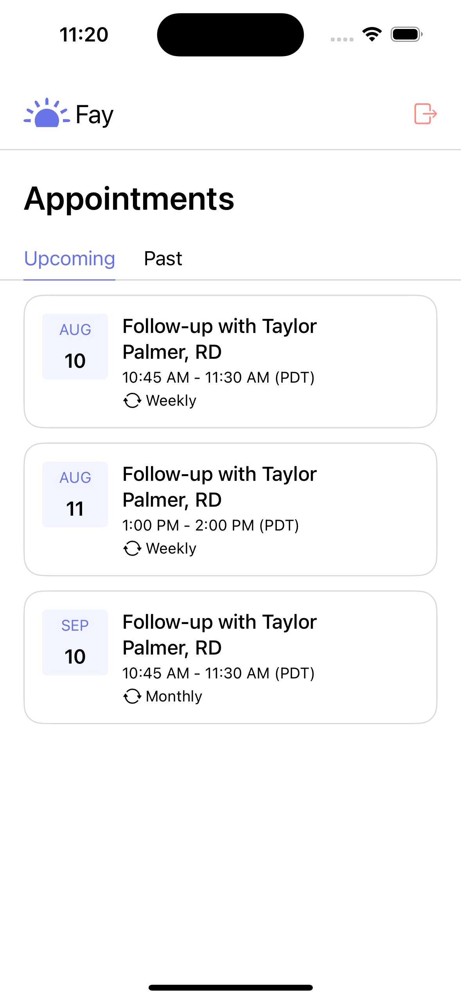
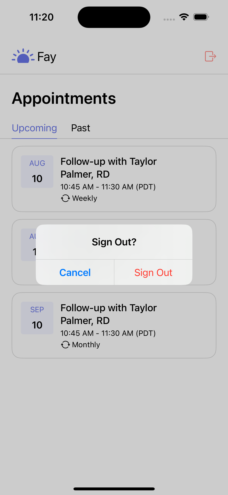
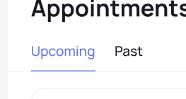
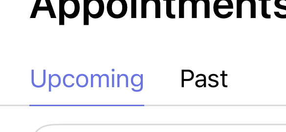
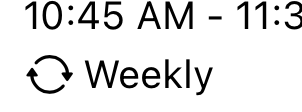
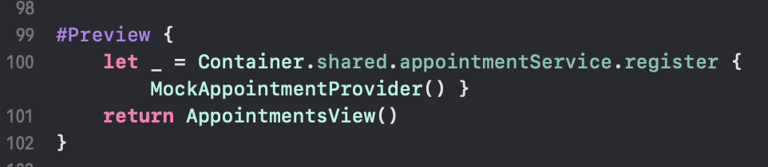
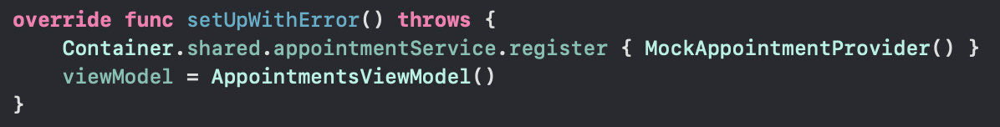

# Fay Project

This was incredibly fun to work on. It was really great to flex some coding muscles and show how I can build clean, organized apps. I hope you are surprised and delighted.

## Fun Bits

I copied (stole) this idea from Fay's website. On the login screen you can see a typing animation with a list of potential helpful use cases for a nutritionist. 

The loading progress spinner is overused, I made a custom little progress indicator using Fay's logo that grows and shrinks to show something is happening 

I added the ability to sign out which will make testing easier, and it just makes sense. 

I tried to really improve the UI as much as possible and I hope that shows even in the small details. You can see here in the original design that the bar under Upcoming is a pixel above the separator 

I thought it would be cleaner to be directly on top of the line 

Unfortunately I didn't have access to all of the custom images so I did have to resort to using SF Symbols for the recurrence image

## Third Party Frameworks

"OMG he used a third party framework in a take home project? 😱" 

Hear me out, Factory (https://github.com/hmlongco/Factory) makes life so much better for SwiftUI. It is dependency injection on steroids. When working with SwiftUI Previews it can be pretty challenging to use mocks, Factory makes that incredible easy as shown here 

It also works in tests 

It also makes initializing services incredibly easy and is very customizable. I wouldn't normally add this in a take home project but I would make this a part of the architecture of the new Fay app.

## Security

We want to avoid storing sensitive information in memory as much as possible as that is a potential threat vector. For that reason, I am using Apple's Keychain to store the auth token that the user receives back when logging in. We store it in the Keychain and only access it when needed.

## Time Spent

- Login (approx 2 hrs)
- Appointments (approx 2hrs)
- All other (approx 3 hours)
